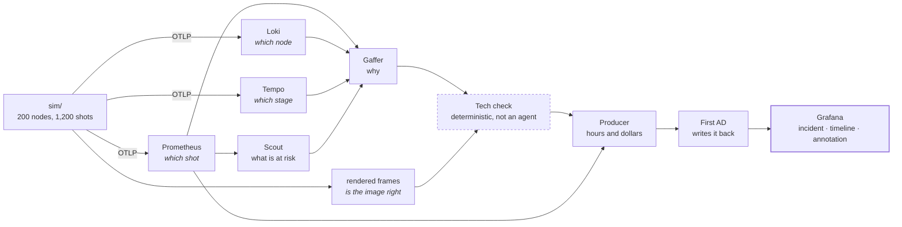

# Shot Clock

**An autonomous SRE crew for a visual effects render farm.**

**Live:** https://shot-clock-669554430519.us-central1.run.app


A VFX studio has 1,200 shots and a delivery date that does not move. Shot Clock
is a crew of Gemini agents that watches the render farm's telemetry in Grafana,
works out which shots will miss the date, proves why, looks at the actual
rendered frame to catch what telemetry cannot, prices the delay in dollars, and
writes the whole investigation back into Grafana.

Render farms are one of the few places in filmmaking where metrics, logs and
traces *are* the product. Thousands of nodes, six-hour jobs that die at 90%,
licence starvation, texture-cache thrash — and a date that a studio has already
sold. This is that problem.

---

## The crew

| Agent | Job | Grafana MCP tools it uses |
|---|---|---|
| **Scout** | Sweeps farm health, finds which shots are at risk | `query_prometheus`, `list_prometheus_metric_names`, `list_prometheus_label_values`, `list_datasources` |
| **Gaffer** | Proves the cause: metrics → logs → traces | `query_loki_logs`, `query_loki_patterns`, `find_error_pattern_logs`, `query_prometheus`, plus `read_frame_trace` (Tempo, read through the datasource proxy) |
| **Producer** | Converts the fault into delivery slip and dollars | `query_prometheus`, `query_prometheus_histogram` |
| **First AD** | Acts: records the investigation in Grafana | `create_incident`, `add_activity_to_incident`, `create_annotation`, `update_dashboard`, `create_snapshot`, `generate_deeplink`, `get_panel_image` |

Plus a **tech check** that is not an agent at all: a deterministic step that
renders the frame and asks Gemini to look at it.

---

## You can make it run, not just watch it

The war room replays a real recorded run by default, because that is instant
and cannot be made to spend money by whoever opens the link. But the honest
objection to any observability-agent demo is *"is this actually running, or is
it a recording?"*, so there is a button that settles it: **Run the crew live**
starts a genuine investigation — four Gemini agents querying Grafana over MCP —
into the same journal the page already renders.

It is capped at six runs a day, one at a time, and it only appears when a
simulator is actually feeding Grafana. There is nothing to investigate
otherwise, and a button that fails is worse than a button that isn't there.

## The two things that make it more than a dashboard chatbot

### 1. It writes back to Grafana

> **See it without an account:** [the dashboard the crew annotated](https://robustspring2217.grafana.net/dashboard/snapshot/p5C6mOBjNlC67o8BAi7aiVfXB5tKLRWK).
> Grafana Cloud has no anonymous access, so a normal dashboard link answers
> `401` to anyone who is not on the stack — which would make the one claim
> that matters most impossible to check. Snapshots are the public route, and
> `create_snapshot` is one of the First AD's own tools.


Most observability agents read. This one opens an incident, adds the diagnosis
to that incident's timeline, stamps an annotation on the dashboard at the moment
the fault began, creates a snapshot, and produces a deeplink. Those artefacts
outlive the agent run — the next engineer to open Grafana finds the
investigation already written down.

### 2. Gemini looks at the frame

Telemetry can only tell you a render *succeeded*. It cannot tell you the plate
came back black, crawling with fireflies, or missing a texture map. Those are
render failures that **exit 0**, and every VFX house pays people to catch them
by eye in dailies.

That is not a gap in instrumentation — it is structural. The renderer has no
idea the image is wrong. So Shot Clock pulls the frame and has Gemini inspect
it, then correlates the visual defect back to the node and the log line from the
same window.

The model is never told which defect to look for, or that one exists. It has to
be able to return `clean`, and it does: on a good plate it correctly reads the
film grain as *"an artistic choice rather than a render defect"*.

---

## Runtime use of Google Cloud and Grafana

Both are called at runtime. Neither is decorative.

**Google Cloud** — `google-adk` and `google-genai`:

| Where | What |
|---|---|
| `agent/crew/*.py` | Four `LlmAgent`s built on `google.adk.agents` |
| `agent/models.py` | `google.adk.models.Gemini`, pinned models, retry options |
| `agent/runtime.py` | `google.adk.runners.Runner` executes each agent |
| `agent/vision.py` | `google.genai` multimodal call with a constrained response schema |
| `agent/mcp.py` | `google.adk.tools.mcp_tool.McpToolset` over stdio |

Set `GOOGLE_GENAI_USE_VERTEXAI=TRUE` with `GOOGLE_CLOUD_PROJECT` and
`GOOGLE_CLOUD_LOCATION` and the same code runs on **Vertex AI**. That is the
configuration the deployed build uses.

**Grafana** — the official [`grafana/mcp-grafana`](https://github.com/grafana/mcp-grafana)
server, run in-process over stdio and authenticated with a Grafana Cloud service
account token. `docs/mcp-tools.txt` is the tool list **enumerated from the
running binary**, not transcribed from documentation.

> The hosted Grafana MCP endpoint authenticates with OAuth 2.1 browser
> authorization, which cannot work from a headless container. The track rules
> permit either; only the self-run server survives deployment.

---

## Architecture

Each signal answers a different question, and the split is forced by the data
model rather than chosen. Shot-scoped metrics carry no `node` label — crossing
node with shot would be 8,000 series against a 10k budget — so getting from
"this shot is slow" to "this node did it" has to go through the logs, and
getting from there to "this stage of the frame absorbed it" has to go through
the trace.



The tech check is drawn dashed because it is the one step no model chooses to
take: a frame that exits 0 with a normal duration produces no signal to react
to, so nothing would ever route to it. It runs because the pipeline says so.

```
sim/          a 200-node render farm working through a 1,200-shot film
  film.py       the shot list, deterministic from a fixed seed
  farm.py       node pool, licences, texture cache, per-frame state machine
  faults.py     oom | licence-starvation | texture-cache-miss | corrupt-frame
  telemetry.py  one OTLP exporter -> metrics, logs and traces to Grafana Cloud
  tracing.py    one trace per frame, sub-spans per pipeline stage
  frames.py     renders actual PNG plates, clean and defective

agent/        the crew
  orchestrator.py  runs the crew in a fixed order; the vision step sits inside
  crew/*.py        Scout, Gaffer, Producer, First AD
  mcp.py           Grafana MCP wiring and per-agent tool allowlists
  vision.py        the tech check
  economics.py     deterministic delivery and cost model
  readings.py      reads the farm's position out of Grafana, in Python
  journal.py       records every run; DEMO MODE replays it

web/          the war room console: shot board, live agent trace, report
```

### Three decisions worth explaining

**Shot-scoped metrics carry no `node` label.** Crossing `node` with `shot_id`
would be 8,000 series for a single metric against a 10k free-tier budget, and
Grafana would silently drop data mid-demo. The node travels on the log lines
instead — so getting from "this shot is slow" to "this node did it" is a
metrics-to-logs hop, which is how an SRE actually works.

**No model computes a number.** Ask a language model to estimate the cost of a
delay and it produces a confident, plausible, *different* number every run. The
costing tool takes no arguments: it reads the farm's position out of Grafana
itself and computes deterministically, and asserts its own components reconcile
with its total. The agents narrate the figures; they never derive them.

**The crew order is fixed; the agents are autonomous.** A model-routed
orchestrator would spend a round trip deciding something already known, and
could pick a different order on the take being filmed. The autonomy lives inside
each agent, where it earns something.

---

## Running it

### Prerequisites

- Python 3.10+
- A Grafana Cloud stack (free tier is enough)
- A Gemini API key, or a Google Cloud project with Vertex AI enabled

### Setup

```bash
pip install -r requirements.txt
cp .env.example .env      # then fill it in
```

Download the Grafana MCP server binary into `bin/`:

```bash
# Linux
curl -sSL https://github.com/grafana/mcp-grafana/releases/latest/download/mcp-grafana_Linux_x86_64.tar.gz | tar xz -C bin/
# Windows: download mcp-grafana_Windows_x86_64.zip from the same release page
```

### Verify the plumbing before building on it

```bash
python scripts/preflight.py          # credentials, OTLP ingest, Grafana read AND write
python scripts/list_mcp_tools.py     # enumerate the MCP tools from the running server
python scripts/verify_writeback.py   # prove annotation, dashboard, snapshot and incident writes
```

### Run

```bash
# 1. start the farm, and break it
python -m sim.main --fault texture-cache-miss

# 2. run the crew against the live telemetry
python -m agent.orchestrator

# 3. open the war room
python -m uvicorn web.server:app --port 8000
```

`python -m sim.main --dry-run` runs the whole simulator with no credentials at
all, if you just want to see the farm work.

---

## Notes for anyone reading the code

- `client.models.list()` advertises Gemini models a key cannot actually call. A
  newly created project counts as a "new user" and is refused older models with
  a 404 raised only at call time. The availability check that matters is a real
  request.
- `mcp` must be pinned below 2.0. Version 2.x renamed `McpError` to `MCPError`,
  which `google-adk` still imports by the old name; the failure is a *silent*
  ImportError that makes `McpToolset` simply cease to exist.
- A Grafana Cloud stack ships three Loki datasources. The alphabetically first
  is `alert-state-history`, which is permanently empty — an agent that lands
  there reports "no logs" and looks broken. The uids are pinned in `agent/mcp.py`.

## What DEMO MODE does and does not do

The war room replays a real recorded crew run — `journals/demo-crew-texture-cache.jsonl`
is the journal of an actual investigation, and every number on screen is one an
agent read from Grafana. The picker refuses any journal that is scripted or
that stops partway, so it cannot quietly fall back to a stand-in.

The replay is **paced**. A real investigation does not pace itself for an
audience: the recorded run spent 66 of its 154 seconds in the Scout and reached
the tech check with 13 seconds left for it. `direct()` in `agent/journal.py`
stretches and compresses each section onto the narration's beats and holds
still after the verdict, so the frame can actually be looked at.

It adds, removes, reorders and alters nothing — same events, same order, same
payloads, asserted in the code. Only the rate of playback changes, which the
existing `speed` and `max_gap` arguments were already doing.

## Licence

MIT — see [LICENSE](LICENSE).
